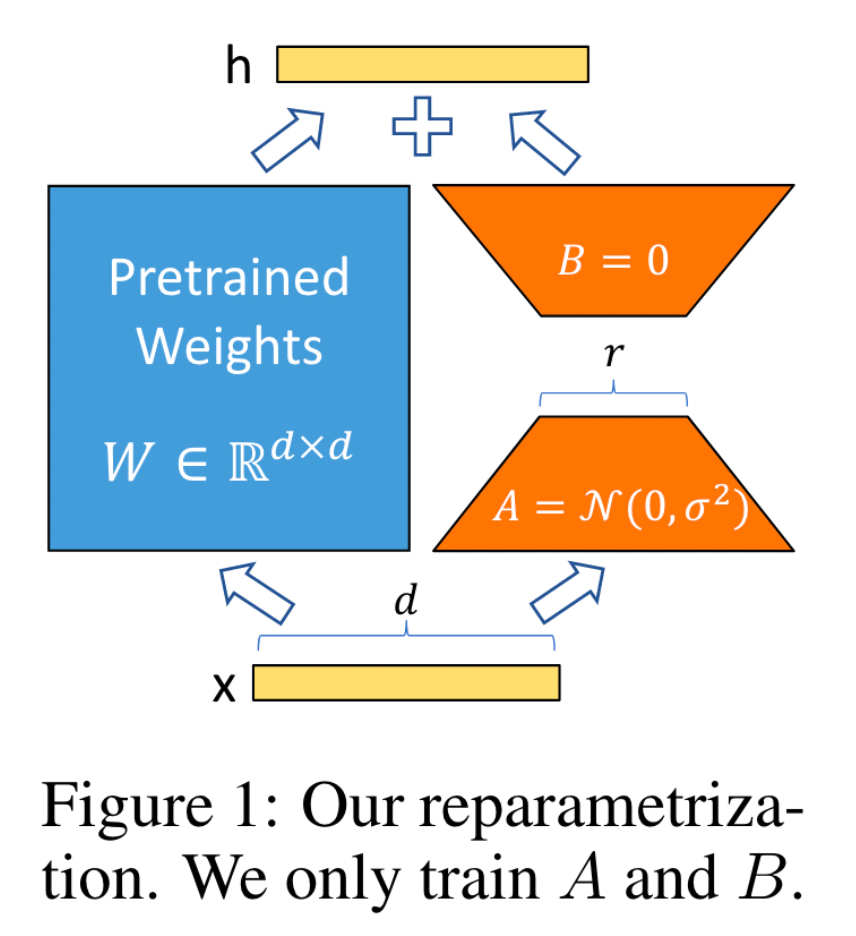

# LoRA：低秩适配的深度学习模型简介

LoRA (Low-Rank Adaptation) 是一种用于高效微调大型预训练模型的方法，旨在降低训练过程中所需的计算资源和存储需求。它通过引入低秩矩阵分解来优化模型参数，从而减少计算量和参数量。

## 一、背景介绍

在深度学习中，特别是自然语言处理（NLP）领域，预训练语言模型（如GPT、BERT等）已经取得了显著的成果。然而，这些模型通常具有数亿甚至数百亿的参数，在进行特定任务的微调时，所需的计算资源和存储需求非常庞大。LoRA 的提出正是为了解决这一问题。

## 二、低秩矩阵分解

在了解 LoRA 之前，首先需要理解低秩矩阵分解的概念。假设有一个矩阵 $W \in \mathbb{R}^{m \times n}$，我们可以将其近似为两个低秩矩阵 $A \in \mathbb{R}^{m \times r}$ 和 $B \in \mathbb{R}^{r \times n}$ 的乘积，即：

$$ W \approx AB $$

其中，$r \ll \min(m, n)$，即 $A$ 和 $B$ 的秩非常低，这样可以极大地减少参数量。

## 三、LoRA 的基本思想

LoRA 的核心思想是将模型中的某些权重矩阵替换为低秩分解的形式。具体来说，对于预训练模型中的权重矩阵 $W_0$，我们可以将其表示为：

$$ W = W_0 + \Delta W $$

其中，$\Delta W$ 是微调过程中学习到的偏移矩阵。使用低秩分解，$\Delta W$ 可以表示为两个低秩矩阵 $A$ 和 $B$ 的乘积：

$$ \Delta W = AB $$

因此，权重矩阵 $W$ 可以表示为：

$$ W = W_0 + AB $$

通过这种方式，我们只需要学习低秩矩阵 $A$ 和 $B$，从而显著减少微调过程中所需的参数量和计算资源。

## 四、公式推导与实现

### 公式推导

假设原始模型的权重矩阵为 $W_0$，输入为 $X$，则输出为：

$$ Y = W_0 X $$

在使用 LoRA 之后，权重矩阵变为 $W = W_0 + AB$，因此新的输出为：

$$ Y = (W_0 + AB)X = W_0X + ABX $$

其中，$A \in \mathbb{R}^{m \times r}$，$B \in \mathbb{R}^{r \times n}$。

### 代码实现

下面是一个简单的代码示例，展示了如何在 PyTorch 中实现 LoRA：

```python
import torch
import torch.nn as nn

class LoRALayer(nn.Module):
    def __init__(self, original_layer, rank):
        super(LoRALayer, self).__init__()
        self.original_layer = original_layer
        self.rank = rank
        
        # 获取原始层的形状
        in_features, out_features = original_layer.weight.shape
        
        # 初始化低秩矩阵 A 和 B
        self.A = nn.Parameter(torch.randn(in_features, rank))
        self.B = nn.Parameter(torch.randn(rank, out_features))
        
        # 初始化偏置
        if original_layer.bias is not None:
            self.bias = nn.Parameter(torch.randn(out_features))
        else:
            self.bias = None

    def forward(self, x):
        # 原始层的输出
        original_output = self.original_layer(x)
        
        # 低秩矩阵的输出
        lora_output = torch.matmul(x, self.A)
        lora_output = torch.matmul(lora_output, self.B)
        
        # 叠加两个输出
        output = original_output + lora_output
        
        if self.bias is not None:
            output += self.bias
        
        return output

# 示例：将线性层替换为 LoRA 版本
original_linear_layer = nn.Linear(128, 64)
lora_layer = LoRALayer(original_linear_layer, rank=4)

# 测试输入
x = torch.randn(32, 128)
output = lora_layer(x)
print(output.shape)  # 输出应为 (32, 64)
```

### 优化与技巧

1. **选择合适的秩 (Rank)**：选择合适的秩 $r$ 对于 LoRA 的性能至关重要。过低的秩可能导致模型性能下降，而过高的秩则会增加计算量。通常，可以通过交叉验证或网格搜索来选择最优的秩。

2. **层选择**：并不是所有层都需要应用 LoRA。通常在模型的某些关键层（如 transformer block 中的 self-attention 层）应用 LoRA 效果最佳。可以通过实验来确定哪些层最适合应用 LoRA。

3. **混合使用**：可以结合其他微调技术（如参数高效微调、剪枝等）与 LoRA 共同使用，以进一步优化模型性能和效率。

4. **初始化**：LoRA 的低秩矩阵 $A$ 和 $B$ 的初始化方式对训练过程有很大影响。通常，可以使用正态分布随机初始化，但也可以尝试其他初始化方法以提升模型性能。

## 五、应用与优势

LoRA 可以应用于各种需要微调的深度学习模型，特别是在资源有限的场景下。其主要优势包括：

1. **减少计算资源**：通过低秩矩阵分解，显著减少了微调过程中所需的计算量。
2. **降低存储需求**：只需存储低秩矩阵的参数，大大减少了参数量。
3. **灵活性强**：可以轻松应用于各种深度学习模型和不同的任务。
4. **性能提升**：在某些情况下，使用 LoRA 微调的模型性能甚至可能优于传统微调方法，因为低秩分解引入了一种正则化效应。

### 应用案例

1. **GPT 微调**：在微调大型 GPT 模型（如 GPT-3）时，使用 LoRA 可以显著减少所需的计算资源和存储需求，同时保持甚至提升模型性能。
2. **BERT 微调**：在特定任务（如情感分析、问答系统等）上微调 BERT 模型时，LoRA 可以帮助快速高效地适配模型。
3. **计算机视觉**：在图像分类、目标检测等任务中，使用 LoRA 微调卷积神经网络（CNN）同样可以取得良好的效果。

### GPT 应用实例

以下是一个在 GPT 模型上应用 LoRA 的示例代码：

```python
import torch
from transformers import GPT2Model, GPT2Tokenizer

class LoRALayerGPT(nn.Module):
    def __init__(self, original_layer, rank):
        super(LoRALayerGPT, self).__init__()
        self.original_layer = original_layer
        self.rank = rank
        
        in_features, out_features = original_layer.weight.shape
        
        self.A = nn.Parameter(torch.randn(in_features, rank))
        self.B = nn.Parameter(torch.randn(rank, out_features))

    def forward(self, x):
        original_output = self.original_layer(x)
        lora_output = torch.matmul(x, self.A)
        lora_output = torch.matmul(lora_output, self.B)
        output = original_output + lora_output
        return output

# 加载预训练的GPT模型和tokenizer
model = GPT2Model.from_pretrained("gpt2")
tokenizer = GPT2Tokenizer.from_pretrained("gpt2")

# 替换GPT模型中的线性层为LoRA版本
for name, module in model.named_modules():
    if isinstance(module, nn.Linear):
        setattr(model, name, LoRALayerGPT(module, rank=4))

# 测试输入
inputs = tokenizer("Hello, how are you?", return_tensors="pt")
outputs = model(**inputs)
print(outputs.last_hidden_state.shape)  # 输出维度应与原始模型一致
```

## 六、结论

LoRA 是一种高效的微调方法，通过引入低秩矩阵分解，解决了大型预训练模型微调过程中资源需求过高的问题。其简单有效的思想和广泛的适用性，使其成为深度学习模型微调中的一种重要技术。

通过本文的介绍，希望你能更好地理解 LoRA 的原理和应用，并能够在实际项目中加以应用。如果你对 LoRA 或其他深度学习技术有任何疑问，欢迎在评论区留言，我们将共同探讨与学习！

---

> 如果你对 LoRA 或其他深度学习技术有任何疑问，欢迎在评论区留言，我们将共同探讨与学习！
