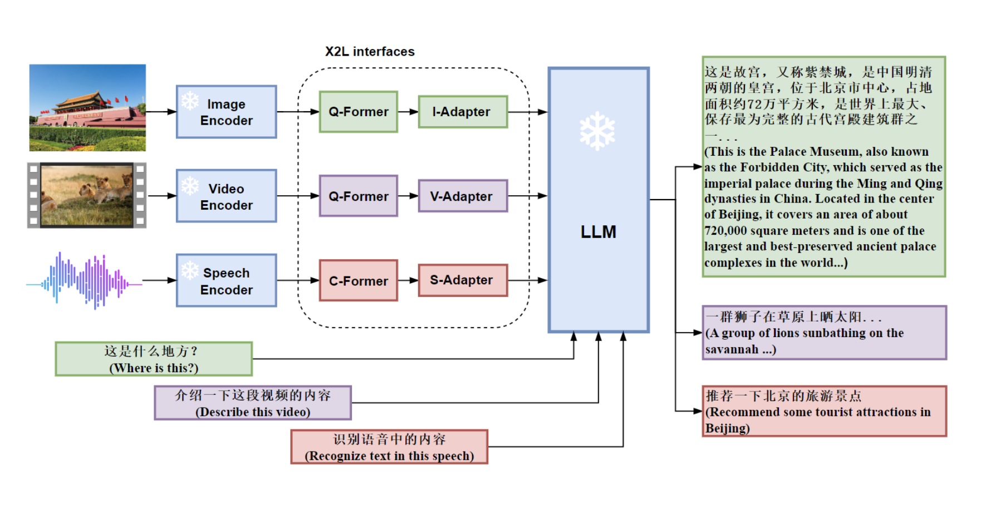

# 掌握MM-LLM的必备知识：原理、实现与示例


## 引言
多模态大语言模型（MM-LLM）是人工智能领域的前沿技术之一，它能够处理和理解多种模态的数据，例如文本、图像、语音等。MM-LLM的出现极大地提升了人工智能系统的理解和生成能力。本文将介绍MM-LLM的基本概念、主要应用、技术原理以及如何在实际项目中实现它，旨在帮助读者快速掌握这一前沿技术。

## 一、MM-LLM的基本概念
### 1. 什么是MM-LLM？
MM-LLM，全称为Multi-Modal Large Language Model，是一种能够同时处理多种模态数据的大型语言模型。这种模型不仅可以处理文本，还能够理解和生成图像、语音等其他类型的数据。

### 2. MM-LLM的优势
- **多模态融合**：能够综合处理和理解多种模态的数据，提高模型的感知能力。
- **增强理解能力**：通过多模态信息互补，提高模型的理解深度和准确性。
- **多样化应用场景**：在图像描述、语音识别、视频分析等多个领域都有广泛应用。

## 二、MM-LLM的主要应用
### 1. 图像描述
MM-LLM可以通过分析图像生成相应的文字描述，这在自动标注、智能相册等领域有重要应用。

### 2. 视频分析
通过处理视频中的图像和音频数据，MM-LLM可以进行复杂的视频内容理解，例如场景识别、事件检测等。

### 3. 多模态翻译
将文本、图像和语音等不同模态的信息进行互译，实现跨模态的信息传递和理解。

## 三、MM-LLM的技术原理
### 1. 多模态数据处理
MM-LLM通过将不同模态的数据编码为统一的表示形式，利用深度学习模型进行处理和融合。常见的编码器包括卷积神经网络（CNN）用于图像处理，循环神经网络（RNN）或变换器（Transformer）用于文本和语音处理。

### 2. 模态融合机制
多模态融合机制是MM-LLM的核心技术之一。常见的融合方法包括：
- **早期融合**：在模型输入层进行多模态数据的融合。
- **中期融合**：在模型的中间层进行多模态数据的融合。
- **晚期融合**：在模型输出层进行多模态数据的融合。

### 3. 注意力机制
注意力机制可以帮助模型在处理多模态数据时，关注更重要的信息。自注意力机制（Self-Attention）和跨模态注意力机制（Cross-Attention）是MM-LLM中常用的技术。

## 四、MM-LLM的实现步骤
### 1. 数据准备
在实现MM-LLM之前，需要准备多模态数据集。以下是一个简单的数据准备示例：

```python
import pandas as pd

# 加载图像数据
image_data = pd.read_csv('image_data.csv')
# 加载文本数据
text_data = pd.read_csv('text_data.csv')
# 合并数据
multi_modal_data = pd.merge(image_data, text_data, on='id')
```

### 2. 数据预处理
对不同模态的数据进行预处理，包括图像的归一化、文本的分词和编码等。

```python
from keras.preprocessing.text import Tokenizer
from keras.preprocessing.sequence import pad_sequences
from keras.preprocessing.image import ImageDataGenerator

# 图像预处理
image_gen = ImageDataGenerator(rescale=1./255)
image_data = image_gen.flow_from_directory('path_to_images', target_size=(224, 224))

# 文本预处理
tokenizer = Tokenizer(num_words=5000)
tokenizer.fit_on_texts(text_data['text'])
text_sequences = tokenizer.texts_to_sequences(text_data['text'])
text_data = pad_sequences(text_sequences, maxlen=100)
```

### 3. 模型构建
构建MM-LLM模型，包括图像编码器、文本编码器和融合层。

```python
from keras.models import Model
from keras.layers import Input, Dense, Embedding, LSTM, Conv2D, MaxPooling2D, Flatten, Concatenate

# 图像编码器
image_input = Input(shape=(224, 224, 3))
x = Conv2D(32, (3, 3), activation='relu')(image_input)
x = MaxPooling2D((2, 2))(x)
x = Flatten()(x)

# 文本编码器
text_input = Input(shape=(100,))
y = Embedding(input_dim=5000, output_dim=128)(text_input)
y = LSTM(128)(y)

# 融合层
merged = Concatenate()([x, y])
output = Dense(1, activation='sigmoid')(merged)

# 构建模型
model = Model(inputs=[image_input, text_input], outputs=output)
model.compile(optimizer='adam', loss='binary_crossentropy', metrics=['accuracy'])
```

### 4. 模型训练
使用多模态数据训练模型，并评估模型性能。

```python
# 模型训练
model.fit([image_data, text_data], labels, epochs=10, batch_size=32)

# 模型评估
loss, accuracy = model.evaluate([image_data, text_data], labels)
print(f'Loss: {loss}, Accuracy: {accuracy}')
```

### 5. 模型预测
使用训练好的模型进行预测。

```python
# 模型预测
predictions = model.predict([image_data, text_data])
print(predictions)
```

## 五、实际案例：图片描述生成
接下来，我们以图片描述生成为例，展示MM-LLM的实际应用。

### 1. 数据集
使用Flickr8k数据集，该数据集包含8000张图像及其相应的描述。

### 2. 数据预处理
对图像和文本数据进行预处理。

```python
from keras.applications.vgg16 import VGG16, preprocess_input
from keras.preprocessing.image import load_img, img_to_array
from keras.preprocessing.text import Tokenizer
from keras.preprocessing.sequence import pad_sequences
import numpy as np

# 图像预处理
def preprocess_image(image_path):
    img = load_img(image_path, target_size=(224, 224))
    img = img_to_array(img)
    img = np.expand_dims(img, axis=0)
    img = preprocess_input(img)
    return img

# 文本预处理
def preprocess_text(texts, tokenizer, max_length):
    sequences = tokenizer.texts_to_sequences(texts)
    sequences = pad_sequences(sequences, maxlen=max_length)
    return sequences

# 加载预训练的VGG16模型
vgg16 = VGG16(include_top=False, input_shape=(224, 224, 3))
```

### 3. 模型构建
构建包含图像编码器和文本编码器的多模态模型。

```python
from keras.layers import Add

# 图像编码器
image_input = Input(shape=(224, 224, 3))
image_features = vgg16(image_input)
image_features = Flatten()(image_features)

# 文本编码器
text_input = Input(shape=(max_length,))
text_embedding = Embedding(input_dim=5000, output_dim=256)(text_input)
text_lstm = LSTM(256)(text_embedding)

# 融合层
merged = Add()([image_features, text_lstm])
output = Dense(5000, activation='softmax')(merged)

# 构建模型
model = Model(inputs=[image_input, text_input], outputs=output)
model.compile(optimizer='adam', loss='categorical_crossentropy')
```

### 4. 模型训练与评估
使用图片和描述数据训练模型，并评估其性能。

```python
# 训练模型
model.fit([image_data, text_data], labels, epochs=20, batch_size=32)

# 模型评估
loss = model.evaluate([image_data, text_data], labels)
print(f'Loss: {loss}')
```

### 5. 模型预测与生成描述
使用训练好的模型为新的图像生成描述。

```python
# 生成描述
def generate_description(model, tokenizer, image, max_length):
    input_text = 'startseq'
    for _ in range(max_length):
        sequence = tokenizer.texts_to_sequences([input_text])[0]
        sequence = pad_sequences([sequence], maxlen=max_length)
        yhat = model.predict([image, sequence], verbose=0)
        yhat = np.argmax(yhat)
        word = tokenizer.index_word[yhat]
        input_text += ' ' + word
        if word == 'endseq':
            break
    return input_text

# 预测新图像的描述
image_path = 'path_to_new_image.jpg'
image = preprocess_image(image_path)
description = generate_description(model, tokenizer, image, max_length)


print(f'Generated Description: {description}')
```

## 结论
本文介绍了MM-LLM的基本概念、主要应用、技术原理以及实现步骤，并通过一个具体的图片描述生成案例展示了如何在实际项目中应用MM-LLM。希望这篇文章能帮助你更好地理解和掌握MM-LLM，并在你的项目中发挥它的强大作用。如果你有任何问题或建议，欢迎在评论区留言，我们一起交流学习。


