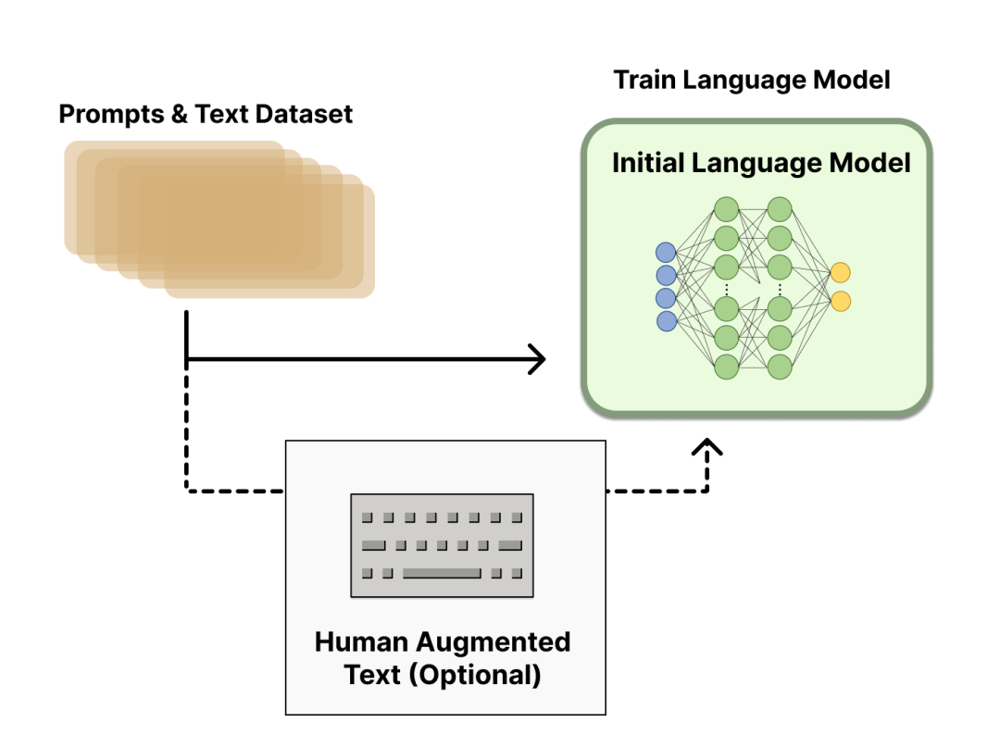

# 什么是RLHF（基于人类反馈的强化学习）？

基于人类反馈的强化学习（Reinforcement Learning from Human Feedback, RLHF）是一种结合强化学习和人类反馈的技术，用于训练智能体，使其行为更符合人类期望。这种方法在自然语言处理（NLP）领域，特别是对话生成任务中，取得了显著的效果。

本文将详细介绍RLHF的概念、公式，并通过示例和代码解释其实现过程。

## RLHF的基本概念

### 强化学习基础

在强化学习（Reinforcement Learning, RL）中，智能体（agent）通过与环境（environment）交互来学习如何采取行动（action），以最大化累积的奖励（reward）。其基本框架包括：

- **状态（State, $s$）**：智能体在某一时刻所处的环境状况。
- **动作（Action, $a$）**：智能体在某一状态下可以采取的行为。
- **奖励（Reward, $r$）**：智能体采取某一动作后，从环境中获得的反馈信号。
- **策略（Policy, $\pi$）**：智能体从状态到动作的映射关系，决定了智能体在特定状态下采取的动作。

强化学习的目标是找到最优策略 $\pi^*$，使得累积奖励最大化。

### 人类反馈的引入

RLHF 在传统强化学习的框架中引入了人类反馈。具体来说，人类会对智能体的行为进行评价，这些评价可以用于指导智能体的学习过程。这种方法特别适用于那些无法直接定义奖励函数的任务，例如自然语言处理中的对话生成。

## RLHF的公式

在 RLHF 中，目标是通过人类反馈来调整策略，以最大化人类评价的累积值。设人类反馈为 $ H(s, a) $，其代表了人类对智能体在状态 $ s $ 下采取动作 $ a $ 的评价。RLHF 的目标是找到使得人类评价累积值最大的策略 $\pi$：

$$ \pi^* = \arg\max_{\pi} \mathbb{E} \left[ \sum_{t=0}^{T} H(s_t, a_t) \mid \pi \right] $$

其中， $T$ 为时间步长的总数。

## 通俗易懂的示例

假设我们有一个聊天机器人，我们希望它能够给出更符合人类期望的回答。我们可以通过以下步骤实现 RLHF：

1. **初始训练**：首先，通过大量对话数据对聊天机器人进行初步训练，使其能够生成合理的对话。
2. **人类反馈收集**：然后，用户与聊天机器人进行交互，并对每次对话给出评分。
3. **策略更新**：根据用户的评分，对聊天机器人的策略进行更新，使其能够生成更符合用户期望的对话。

### 示例代码

以下是一个简化的 RLHF 实现示例，使用 Python 代码展示如何通过人类反馈来优化对话生成策略。

```python
import numpy as np

class ChatBot:
    def __init__(self, initial_policy):
        self.policy = initial_policy
    
    def generate_response(self, state):
        action_prob = self.policy[state]
        action = np.random.choice(len(action_prob), p=action_prob)
        return action
    
    def update_policy(self, state, action, reward):
        self.policy[state][action] += reward
        self.policy[state] = self.policy[state] / np.sum(self.policy[state])

def human_feedback(state, action):
    # 简化的人类反馈函数，返回随机反馈
    return np.random.uniform(-1, 1)

# 初始化策略
initial_policy = {
    0: [0.5, 0.5],
    1: [0.5, 0.5]
}

chatbot = ChatBot(initial_policy)

# 模拟对话
states = [0, 1]
for epoch in range(100):
    for state in states:
        action = chatbot.generate_response(state)
        reward = human_feedback(state, action)
        chatbot.update_policy(state, action, reward)

# 输出最终策略
print(chatbot.policy)
```

在上述代码中，`ChatBot`类代表了一个简单的聊天机器人。`generate_response`方法根据当前策略生成响应，`update_policy`方法根据人类反馈更新策略。`human_feedback`函数模拟了人类反馈。在训练过程中，策略逐渐优化，以生成更符合人类期望的响应。

## 常用的技巧

在实际应用中，RLHF 涉及许多细节和技巧，以确保智能体能够高效地学习和优化策略。以下是一些常用的技巧：

### 1. 正则化（Regularization）

为了防止策略过拟合人类反馈，可以引入正则化项。例如，可以对策略的变化进行限制，避免过度调整。

$$ L(\pi) = \mathbb{E} \left[ \sum_{t=0}^{T} H(s_t, a_t) \mid \pi \right] - \lambda \|\pi - \pi_0\|^2 $$

其中，$\pi_0$ 是初始策略，$\lambda$ 是正则化参数。

### 2. 多样性奖励（Diversity Reward）

为了鼓励智能体生成多样化的行为，可以引入多样性奖励。例如，可以通过测量生成对话的多样性来调整奖励函数。

### 3. 平滑策略更新（Smooth Policy Update）

为了防止策略更新过于激进，可以采用平滑策略更新的方法。例如，可以使用软更新（soft update）的方法逐步调整策略。

$$ \pi_{\text{new}} = \alpha \pi_{\text{new}} + (1 - \alpha) \pi_{\text{old}} $$

其中，$\alpha$ 是更新速率参数。

### 4. 逆强化学习（Inverse Reinforcement Learning, IRL）

在某些情况下，可以通过逆强化学习的方法，从人类行为中学习奖励函数，然后在此基础上进行优化。

### 5. 增量式学习（Incremental Learning）

为了在新数据和新反馈到来时持续优化策略，可以采用增量式学习的方法，不断更新智能体的知识和策略。

## 总结

基于人类反馈的强化学习（RLHF）是一种结合强化学习和人类反馈的技术，通过人类对智能体行为的评价，指导智能体的学习过程，使其行为更符合人类期望。本文通过公式、通俗易懂的示例和简化的代码解释了RLHF的基本原理和实现方法，并介绍了一些常用的技巧，以帮助读者更好地理解和应用这一技术。希望这些内容能够为读者提供有价值的参考。