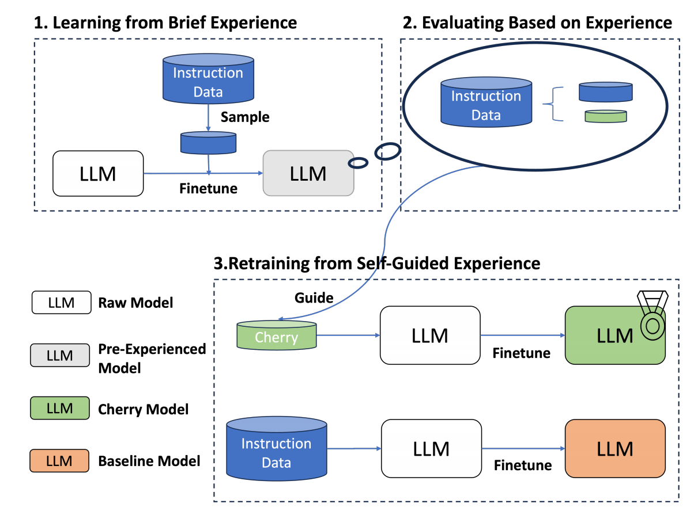

### 大模型应用中什么是SFT（监督微调）？

#### 一、SFT的基本概念

监督微调（Supervised Fine-Tuning, SFT）是对已经预训练的模型进行特定任务的训练，以提高其在该任务上的表现。预训练模型通常在大量通用数据上进行训练，学到广泛的语言知识和特征。在SFT过程中，利用特定任务的数据，对模型进行进一步调整，使其更适合该任务。

#### 二、SFT的原理

SFT的过程可以分为以下几个步骤：

1. **预训练模型**：
   - 在大规模通用数据集（例如维基百科、书籍语料库等）上进行预训练。
   - 通过无监督学习，模型学习到丰富的语言表示（如词语之间的关系、句子结构等）。
   - 预训练阶段使用的目标函数通常是语言模型任务的损失函数，如语言建模损失：
     $$
     L_{\text{pretrain}}(\theta) = -\frac{1}{N} \sum_{i=1}^{N} \log P(x_i | x_{<i}; \theta)
     $$
     其中，$x_i$ 是句子中的第 $i$ 个词，$x_{<i}$ 是它之前的所有词，$\theta$ 是模型的参数。

2. **准备任务特定数据集**：
   - 选择特定任务的数据集，例如情感分析（包含正面和负面标签）、文本分类（不同类别的标签）等。
   - 对数据进行预处理和标注。

3. **监督微调**：
   - 使用任务特定的数据集对预训练模型进行微调。
   - 在微调过程中，模型的参数会根据特定任务的数据进行更新，以优化模型在该任务上的表现。
   - 微调阶段使用的目标函数通常是监督学习任务的损失函数，如交叉熵损失：
     $$
     L_{\text{fine-tune}}(\theta) = -\frac{1}{N} \sum_{i=1}^{N} \sum_{j=1}^{C} y_{ij} \log P(y_j | x_i; \theta)
     $$
     其中，$y_{ij}$ 是样本 $i$ 在类别 $j$ 上的真实标签，$P(y_j | x_i; \theta)$ 是模型对样本 $i$ 预测为类别 $j$ 的概率。

#### 三、SFT的优势

1. **提高模型性能**：通过在特定任务的数据上进行微调，模型可以显著提高在该任务上的表现。
2. **减少标注数据需求**：由于预训练模型已经在大量数据上进行过训练，SFT通常只需要较少的标注数据即可达到良好的效果。
3. **灵活性**：SFT可以应用于各种任务，如文本分类、情感分析、机器翻译等。

#### 四、SFT在GPT中的应用

GPT（Generative Pre-trained Transformer）是一种预训练语言模型，通过SFT，可以将其应用于各种特定任务。以下是一些具体的应用场景：

1. **文本分类**：使用GPT模型进行情感分析或主题分类。
2. **问答系统**：通过微调GPT模型，使其能够回答特定领域的问题。
3. **对话生成**：微调GPT模型，使其生成更符合特定风格或主题的对话。

#### 五、SFT的代码示例

下面是使用Hugging Face的Transformers库对GPT模型进行监督微调的示例代码：

```python
import torch
from transformers import GPT2Tokenizer, GPT2ForSequenceClassification, Trainer, TrainingArguments
from datasets import load_dataset

# 加载预训练的GPT-2模型和分词器
model_name = "gpt2"
tokenizer = GPT2Tokenizer.from_pretrained(model_name)
model = GPT2ForSequenceClassification.from_pretrained(model_name, num_labels=2)

# 加载数据集
dataset = load_dataset('imdb')
train_dataset = dataset['train'].map(lambda e: tokenizer(e['text'], truncation=True, padding='max_length'), batched=True)
train_dataset.set_format(type='torch', columns=['input_ids', 'attention_mask', 'label'])

# 定义训练参数
training_args = TrainingArguments(
    output_dir='./results',
    num_train_epochs=3,
    per_device_train_batch_size=8,
    per_device_eval_batch_size=8,
    warmup_steps=500,
    weight_decay=0.01,
    logging_dir='./logs',
)

# 定义Trainer
trainer = Trainer(
    model=model,
    args=training_args,
    train_dataset=train_dataset,
)

# 进行监督微调
trainer.train()
```

#### 六、总结

监督微调（SFT）通过使用特定任务的数据集对预训练模型进行进一步训练，从而优化模型在该任务上的性能。这种方法在自然语言处理领域有广泛的应用，如文本分类、问答系统和对话生成等。通过结合预训练和微调，SFT能够在较少的数据和计算资源下实现高效的模型性能提升。

希望这篇文章能帮助您更好地理解监督微调（SFT）的概念和应用。如果您有任何疑问或需要进一步的帮助，请随时在评论区留言！