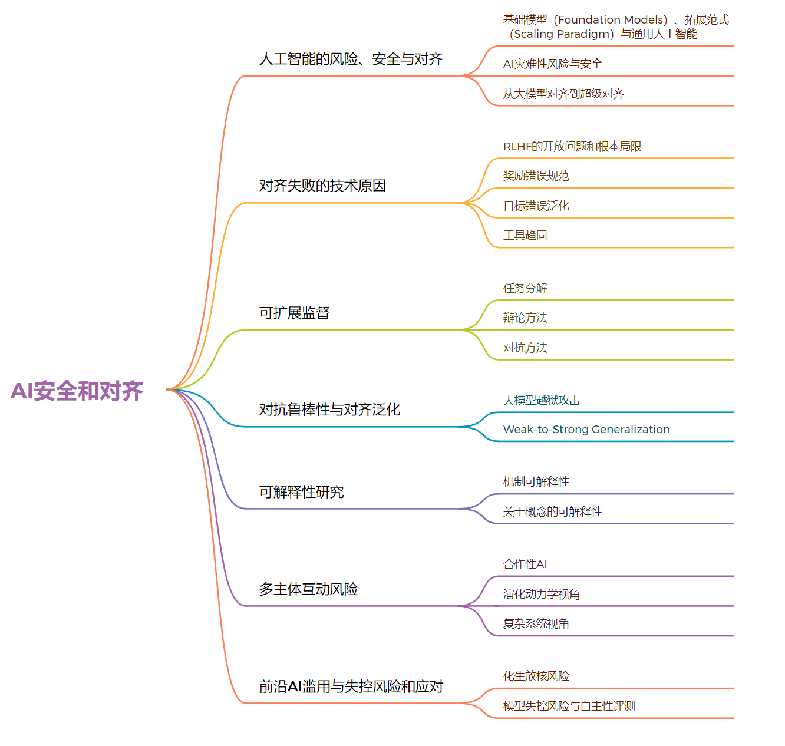

### 大模型应用中的安全对齐

随着人工智能技术的不断发展，大规模语言模型（如GPT-4）的应用越来越广泛。为了保证这些大模型在实际应用中的性能和安全性，安全对齐（Safe Alignment）成为一个重要的概念。

#### 什么是大模型应用中的安全对齐？

在大模型应用中，安全对齐通常指的是确保模型的输出和行为与预期目标和社会规范相一致，不会产生有害或不当的结果。具体而言，这涉及以下几个方面：

1. **伦理和道德对齐**：确保模型的输出不违反伦理和道德准则。
2. **法律和法规对齐**：确保模型的行为符合相关法律和法规要求。
3. **用户意图对齐**：确保模型的输出与用户的预期和需求一致，避免误导或错误的信息。
4. **社会价值对齐**：确保模型的行为和输出符合社会普遍接受的价值观和标准。

#### 为什么需要安全对齐？

1. **避免有害输出**：未对齐的大模型可能生成有害、错误或偏见的内容，对用户和社会产生负面影响。
2. **增强信任**：通过确保安全对齐，用户可以更加信任模型的输出，增强用户体验。
3. **符合法规要求**：许多国家和地区对AI技术的应用有严格的法律和法规要求，安全对齐有助于避免法律风险。

#### 实现安全对齐的方法

1. **训练阶段**：
    - **数据选择**：选择符合伦理和法律要求的数据进行训练，避免偏见和有害信息的传播。
    - **对齐目标**：在训练过程中明确对齐目标，使用技术手段引导模型朝着正确的方向优化。

2. **验证和测试阶段**：
    - **测试用例**：设计多样化的测试用例，涵盖各种可能的场景，确保模型在不同情况下的输出都是安全和可靠的。
    - **伦理审核**：引入伦理审核环节，邀请伦理专家和法律顾问对模型的行为进行审查。

3. **部署阶段**：
    - **实时监控**：部署后对模型的输出进行实时监控，及时发现和纠正不符合对齐目标的行为。
    - **用户反馈**：建立用户反馈机制，及时采纳用户意见，持续改进模型的对齐效果。

#### 实例：安全对齐的实践

以下是一个通俗易懂的示例，说明如何在大模型应用中实现安全对齐。

假设我们开发了一款智能对话助手，其主要功能是回答用户的问题并提供建议。在实现安全对齐时，我们可以采取以下措施：

1. **数据选择**：在训练数据中，优先选择官方文档、权威出版物等高质量资料，避免使用来源不明或含有偏见的信息。
2. **对齐目标**：明确对齐目标，如不生成含有歧视、暴力、色情等内容的输出，并引导模型朝着这些目标优化。
3. **测试用例**：设计一系列测试用例，如用户咨询法律问题、健康问题等，确保模型的回答准确且符合相关法规。
4. **伦理审核**：邀请伦理专家对模型的行为进行审核，确保其输出不会侵犯用户隐私或引发伦理争议。
5. **实时监控**：部署后对模型的输出进行实时监控，发现不符合对齐目标的输出时及时修正，并记录问题以便进一步改进模型。

#### 公式和数据支持

在实现安全对齐过程中，可以使用一些具体的公式和数据来帮助优化模型。以下是一些常用的方法：

1. **交叉熵损失函数（Cross-Entropy Loss）**：
   $$
   L(y, \hat{y}) = -\sum_{i} y_i \log(\hat{y}_i)
   $$
   其中，$y$ 是真实标签，$\hat{y}$ 是模型的预测概率。交叉熵损失函数常用于分类任务，通过最小化损失函数，可以优化模型的预测准确性。

2. **偏差检测指标（Bias Detection Metrics）**：
   - **混淆矩阵（Confusion Matrix）**：用于评估模型在不同类别上的表现，通过分析误分类情况，检测是否存在偏差。
   - **公平性指标（Fairness Metrics）**：如差异影响（Disparate Impact）和均衡误差率（Equalized Odds），用于评估模型在不同群体上的公平性。

3. **用户满意度调查数据**：
   - **净推荐值（Net Promoter Score, NPS）**：通过用户反馈调查，评估用户对模型输出的满意度，从而优化模型的对齐效果。

#### 数据支持示例

假设我们有一组用户满意度调查数据，显示用户对模型输出的满意度分布如下：

| 评分 | 用户数 |
| --- | --- |
| 1   | 10  |
| 2   | 20  |
| 3   | 30  |
| 4   | 25  |
| 5   | 15  |

通过计算净推荐值（NPS），我们可以评估用户对模型的整体满意度：

$$
\text{NPS} = \frac{\text{推荐者数} - \text{贬低者数}}{\text{总用户数}} \times 100
$$

其中，评分为4和5的用户为推荐者，评分为1和2的用户为贬低者。计算得出：

$$
\text{推荐者数} = 25 + 15 = 40
$$
$$
\text{贬低者数} = 10 + 20 = 30
$$
$$
\text{总用户数} = 10 + 20 + 30 + 25 + 15 = 100
$$
$$
\text{NPS} = \frac{40 - 30}{100} \times 100 = 10
$$

通过分析NPS值，我们可以发现用户对模型的满意度偏低，需要进一步优化模型以提高用户体验。

### 额外的补充内容

为了更全面地理解大模型应用中的安全对齐，我们可以从以下几个方面进一步探讨：

#### 案例研究

1. **ChatGPT的安全对齐案例**：
    - **背景**：OpenAI在开发ChatGPT时，采用了大量的安全对齐措施，以确保模型输出符合伦理和社会规范。
    - **措施**：包括使用RLHF（Reinforcement Learning from Human Feedback）技术，通过人工反馈不断优化模型行为；引入严格的内容审核机制，避免模型生成有害内容。
    - **效果**：在实际应用中，ChatGPT在大多数情况下能够生成有用且安全的输出，但仍存在一些挑战和改进空间。

2. **微软小冰的安全对齐案例**：
    - **背景**：微软小冰是一款广受欢迎的智能对话系统，在应用过程中也面临着安全对齐的挑战。
    - **措施**：通过设置内容过滤机制，避免生成不当言论；引入用户举报机制，及时修正不符合对齐目标的输出。
    - **效果**：微软小冰在实际应用中表现良好，但偶尔会出现对齐失误的情况，反映了安全对齐的重要性和难度。

#### 安全对齐的挑战

1. **多样化用户需求**：不同用户的需求和预期各不相同，如何在满足个性化需求的同时确保安全对齐，是一个重要的挑战。
2. **动态变化的社会规范**：社会规范和价值观是动态变化的，模型需要不断适应和更新，以确保输出始终符合当前的社会标准。
3. **技术实现难度**：实现安全对齐需要复杂的技术手段和大量的资源投入，如何在技术和成本之间找到平衡，是另一个重要的挑战。

#### 未来展望

1. **智能化的安全对齐机制**：随着AI技术的发展，可以引入更智能的对齐机制，如自适应对齐（Adaptive Alignment），根据用户反馈和行为自动调整模型输出。
2. **跨领域合作**：安全对齐不仅是技术问题，还涉及伦理、法律等多个领域的知识。未来可以加强跨领域合作，推动安全对齐技术的发展和应用。
3. **用户参与的对齐优化**：通过引入用户参与机制，如用户反馈、用户调研等，不断优化和改进模型的对齐效果，提升用户满意度。

### 结论

大模型应用中的安全对齐是保障模型输出可靠性和安全性的重要措施。通过合理的数据选择、明确的对齐目标、全面的测试和持续的监控，可以有效实现安全对齐，确保大模型在实际应用中的性能和安全性。随着技术的发展和应用的深入，安全对齐将成为AI领域的重要研究方向，不断推动AI技术的安全和健康发展。

希望这篇博客对你理解大模型应用中的安全对齐有所帮助。如果你有更多问题或想法，欢迎在评论区留言讨论！