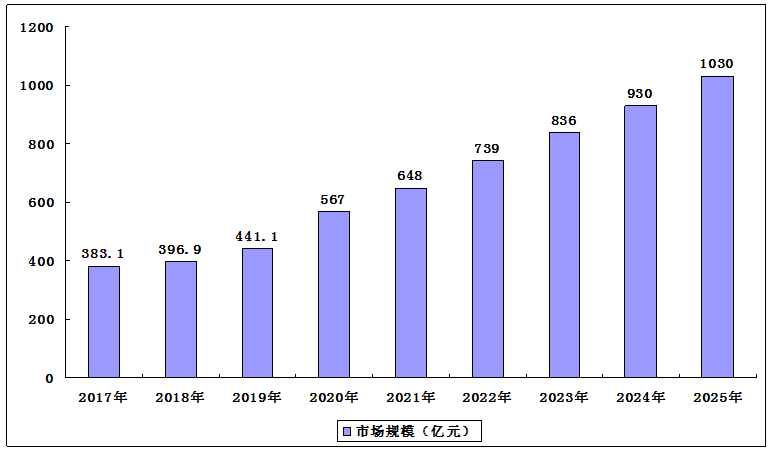

## 基于智能座舱视觉DMS/OMS/RMS的简介

### 引言
随着智能驾驶技术的迅猛发展，智能座舱逐渐成为汽车科技领域的热点话题。在智能座舱系统中，驾驶员监控系统（DMS）、乘员监控系统（OMS）以及舱室监控系统（RMS）是三大重要的子系统。本文将详细介绍DMS、OMS和RMS的发展历史，并探讨其在未来智能驾驶中的应用前景，结合当前法规要求和业界现状，提供真实可信的数据支持。

### 一、驾驶员监控系统（DMS）

#### 1.1 DMS的起源
驾驶员监控系统最早可以追溯到20世纪90年代，最初的研究主要集中在检测驾驶员的疲劳状态。随着计算机视觉技术的发展，DMS开始应用于商用车辆，以减少因疲劳驾驶引发的交通事故。

#### 1.2 DMS的发展历程
1. **早期阶段（1990s-2000s）**：早期的DMS系统主要基于传感器技术，通过眼动检测来判断驾驶员的疲劳状态。这一阶段的系统相对简单，检测精度较低。
2. **中期阶段（2010s）**：随着图像处理和计算机视觉技术的进步，DMS系统开始利用摄像头捕捉驾驶员的面部特征，通过图像分析来检测驾驶员的注意力状态。该阶段的系统精度有所提升，但在实际应用中仍面临挑战。
3. **现代阶段（2020s-至今）**：现代DMS系统结合了深度学习算法，通过更高分辨率的摄像头和更强大的计算能力，实现了更为精准的驾驶员状态监控。系统不仅可以检测疲劳状态，还可以识别分心、情绪等多种驾驶员状态。

#### 1.3 关键技术
- **图像处理**：包括面部识别、眼动跟踪、表情识别等技术。
- **深度学习**：利用神经网络模型提升识别精度。
- **多传感器融合**：结合摄像头、红外传感器等多种传感器的数据，提高系统的鲁棒性。

#### 1.4 法规要求与业界现状
- **欧盟**：2022年，欧盟通过了一项法规，要求到2024年所有新生产的车辆必须配备DMS系统 。
- **中国**：2021年，中国发布了《汽车驾驶自动化系统安全要求》，其中明确规定了DMS系统在L2及以上自动驾驶车辆中的应用要求 。
- **北美**：美国国家公路交通安全管理局（NHTSA）也在积极推动DMS系统的应用，并计划在未来几年内推出相关法规 。

### 二、乘员监控系统（OMS）

#### 2.1 OMS的起源
乘员监控系统的研究起步较晚，其起源可以追溯到2010年前后，主要目的是为了提升车内乘员的安全性和舒适性。OMS系统通过监控车内乘员的行为和状态，提供相应的安全和娱乐功能。

#### 2.2 OMS的发展历程
1. **起步阶段（2010s）**：早期的OMS系统主要用于检测乘员的有无、座椅位置等简单信息。这一阶段的系统功能有限，主要依赖于传统传感器。
2. **发展阶段（2020s）**：随着计算机视觉和人工智能技术的引入，OMS系统开始具备乘员身份识别、行为分析等高级功能。系统能够识别乘员的面部特征、手势动作，并据此提供个性化服务。
3. **未来阶段**：未来的OMS系统将更加智能，能够实时分析乘员的情绪、健康状况，并与其他车载系统进行联动，提供更加全面的安全和舒适保障。

#### 2.3 关键技术
- **人脸识别**：用于乘员身份验证和个性化设置。
- **手势识别**：通过手势控制车载系统，提高交互体验。
- **行为分析**：分析乘员的动作和状态，提供安全预警和健康监测。

#### 2.4 法规要求与业界现状
- **欧盟**：欧盟对OMS系统尚无强制性法规，但鼓励在豪华车型中应用，以提升乘员的舒适性和安全性 。
- **中国**：中国在2021年发布的《智能网联汽车信息安全技术要求》中提到，未来高端车型将逐步配备OMS系统 。
- **北美**：北美市场对于OMS系统的需求主要集中在豪华车市场，相关法规还在制定过程中 。

### 三、舱室监控系统（RMS）

#### 3.1 RMS的起源
舱室监控系统主要用于监控整个车内环境，最早起源于豪华车型和特殊用途车辆，如警车和救护车。RMS系统可以实时监控车内情况，提升乘员的安全性和舒适性。

#### 3.2 RMS的发展历程
1. **初步阶段**：早期的RMS系统主要依赖于固定摄像头和简单的传感器，用于监控车内环境。这一阶段的系统功能较为基础，主要用于安全监控。
2. **中期阶段**：随着传感器技术和图像处理技术的发展，RMS系统开始引入多摄像头和高精度传感器，实现对车内环境的全方位监控。这一阶段的系统能够实时捕捉车内每个角落的情况，并进行智能分析。
3. **未来阶段**：未来的RMS系统将更加智能化和集成化，能够与车内其他系统无缝连接，实现车内环境的智能调控。例如，根据乘员的状态调整车内温度、灯光等。

#### 3.3 关键技术
- **多摄像头系统**：实现车内环境的全方位监控。
- **智能分析**：通过深度学习算法分析车内情况，提供智能化的安全预警和环境调节。
- **传感器融合**：结合多种传感器数据，提高系统的感知能力和精度。

#### 3.4 法规要求与业界现状
- **欧盟**：欧盟目前对RMS系统的法规尚在制定中，但预计未来几年内将出台相关要求 。
- **中国**：中国在《智能网联汽车技术路线图》中提出了未来RMS系统的发展方向，强调其在提升车内安全性和舒适性方面的重要作用 。
- **北美**：北美市场对于RMS系统的需求主要集中在豪华车和特殊用途车辆上，相关法规还在探讨中 。

### 四、未来展望

随着人工智能和物联网技术的不断发展，智能座舱中的DMS、OMS和RMS将进一步融合，形成一个统一的智能监控系统。这一系统将不仅仅用于安全监控，还将为乘员提供更加智能化和个性化的服务。例如，根据乘员的状态自动调整座椅、温度、音响等，提升驾驶和乘坐体验。

未来，随着自动驾驶技术的成熟，智能座舱系统将在提升驾驶安全性和舒适性方面发挥更加重要的作用。根据市场研究机构的预测，全球DMS市场规模预计将从2021年的约10亿美元增长至2026年的约30亿美元，年均增长率超过20% 。通过对DMS、OMS和RMS的深入研究和应用，我们可以预见，未来的智能汽车将更加安全、智能和人性化。

### 结语

本文回顾了智能座舱中DMS、OMS和RMS的发展历史，分析了其关键技术和未来发展趋势。结合当前法规要求和业界现状，这些系统将在未来智能汽车中发挥越来越重要的作用，为我们带来更加安全和舒适的驾驶体验。

希望本文能够为大家提供有价值的信息，激发更多对智能座舱技术的兴趣和研究。

---

> 本文旨在为读者提供关于智能座舱中DMS、OMS和RMS的全面了解，若有任何疑问或建议，欢迎在评论区留言交流。

